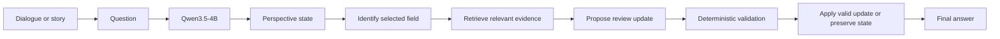
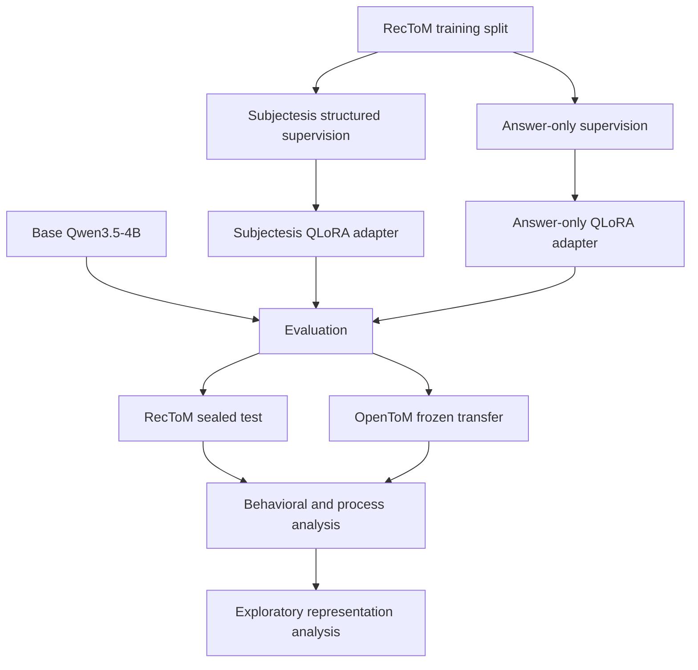

# Subjectesis architecture

The implemented system separates the language model from the deterministic
controller. The model interprets the dialogue and proposes state content. The
controller checks structure, applies a bounded update, and controls stopping.

## Training and evaluation relationship

## Cognitive-science interpretation

The design is motivated by a functional distinction between monitoring and
control. The perspective state records what is currently represented. Review
checks a selected part of that state against supplied evidence. The controller
then either preserves or updates the selected field.

This is a computational analogy, not a claim that transformer components map
onto particular brain regions. The dissertation treats perspective tracking,
monitoring and revision as functional constructs that can be implemented and
tested in an AI system.
